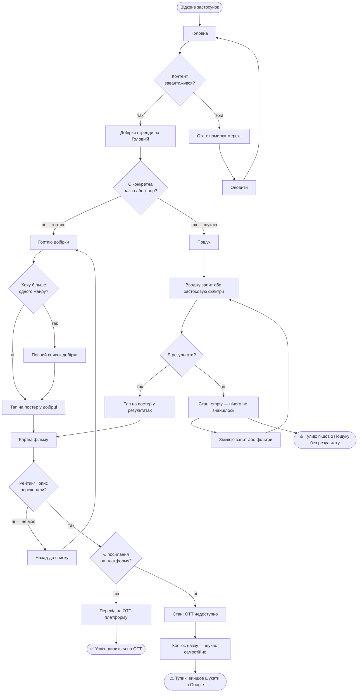
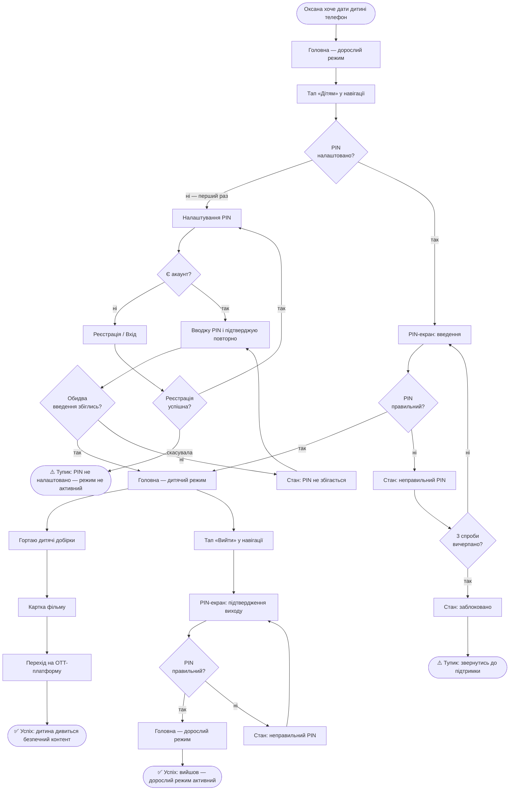
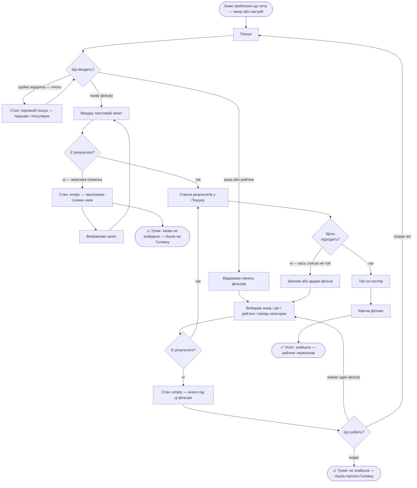

# User Flows — Onespace

> Вузли-екрани `[у квадратних дужках]` — відповідають sitemap.md.
> Рішення `{у фігурних дужках}` — розгалуження.
> Стани `[Стан: ...]` — окремі вузли всередині існуючого екрана (не нові екрани).
> `([...])` — термінальні точки: успіх або тупик.

---

## Main Job — Знайти фільм і перейти до перегляду

> Персони: всі три (Оксана, Дмитро, Ірина).
> Два шляхи: browse (без запиту) і search (з запитом). Обидва сходяться на Картці фільму.

---

## J2 — Безпечний простір для дитини

> Персона: Оксана (primary).
> Три сценарії: перший запуск (налаштування PIN), повторний візит (введення PIN), вихід з режиму (підтвердження PIN).

---

## J3 — Звуження без перегляду всього підряд

> Персони: Оксана (5 хв на вибір), Ірина («не гортати 20 хвилин»).
> Два шляхи всередині Пошуку: текстовий запит і панель фільтрів. Обидва ведуть до списку результатів.

